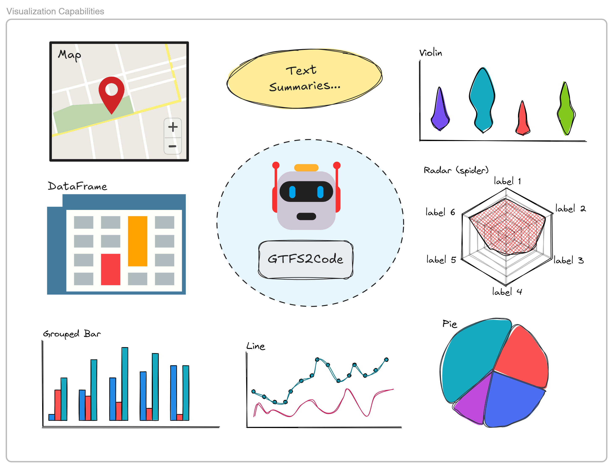
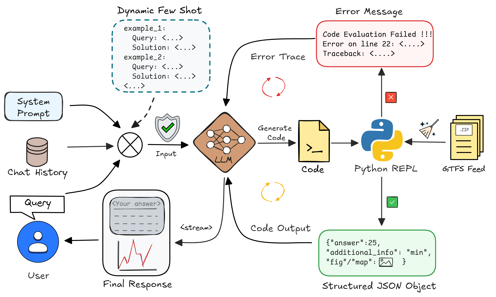

# TransitGPT 🚌

TransitGPT is a specialized chatbot that helps transit enthusiasts retrieve transit information and analyze GTFS feeds via code.


<p align="center">
  
</p>

## 🏗️ Architecture Overview

<p align="center">
  
</p>

This diagram illustrates the high-level architecture of the TransitGPT system, showing how different components interact. The workflow consists of 4 key steps:

1. **Moderation**
   - All queries are moderated
   - Irrelevant queries are blocked

2. **Main LLM**
   - Generates code response for the query of interest

3. **Code Execution** 
   - Code generated by the main LLM is executed in a safe environment
   - Includes retry mechanism for failed executions

4. **Summary**
   - Results are summarized in a chat-like response format


## ✨ Features

- Interactive chat interface for querying GTFS data
- Code generation and execution for GTFS analysis
- Support for multiple LLM models. Default models are: `Claude 3.5 Sonnet`, `Claude 3.5 Haiku`, `GPT-4o`, `GPT-4o-mini`
- Visualization of results using Matplotlib, Plotly, and Folium
- Feedback system for user interactions
- Support for multiple GTFS feeds
- Support for multiple visualization types including:
  - Static/Interactive maps
  - Static/Interactive plots
  - Tables (DataFrames)

## 🛠️ Setup

1. **Create a virtual environment** (recommended):
   ```bash
   python -m venv venv
   source venv/bin/activate  # On Windows use `venv\Scripts\activate`
   ```
2. Install the required dependencies:
   ```bash
   pip install -r requirements.txt
   ```
3. Ensure you have the necessary GTFS data files and update the `gtfs_data/file_mapping.json` accordingly:

   - **Add a New GTFS Feed**:
     - **Place the GTFS File**: Add the GTFS zip file to the appropriate directory within `gtfs_data/`.
     - **Update `file_mapping.json`**: Add a new entry for the transit agency in the following format:
        ```json
        "New Transit": {
          "file_loc": "gtfs_data/New Transit Agency/gtfs.zip",
          "distance_unit": "m",
          "pickle_loc": "gtfs_data/feed_pickles/New_Transit_gtfs_loader.pkl"
        }
        ```

4. Generate pickled GTFS feeds for faster loading:
   ```bash
   python utils/generate_feed_pickles.py
   ```
5. Set up your environment variables for API keys and other sensitive information:
   - Create a `.streamlit/secrets.toml` file in your project directory.
   - Add your API keys in the following format:
     ```toml
     [general]
     OPENAI_API_KEY = "your_openai_api_key"
     GROQ_API_KEY = "your_groq_api_key"
     ANTHROPIC_API_KEY = "your_anthropic_api_key"
     GMAP_API = "your_google_maps_api_key"
     ```
   - Ensure that this file is not included in version control by adding it to your `.gitignore`.

6. Run the Streamlit app:
   ```bash
   streamlit run chat_app.py
   ```

## 📱 Usage

1. Select an LLM model and GTFS feed from the sidebar
2. Type your query in the chat input or select a sample question
3. View the generated code, execution results, and visualizations
4. Provide feedback on the responses

## ⚙️ Configuration

- LLM models available: Claude 3.5 Sonnet, GPT-4o, GPT-4o-mini, Llama 3.1 8B Instant
- Maximum chat history: `16` messages
- Timeout for code execution: `5` minutes

## 📁 Project Structure

- `chat_app.py`: Main Streamlit application
- `components/`: UI components and interface setup
- `utils/`: Utility functions and helper methods
- `prompts/`: LLM prompts and examples
- `data/`: Sample questions and few-shot examples
- `gtfs_data/`: GTFS feed files and mappings
- `gtfs_agent/`: GTFS data loading, processing, and LLM agent
- `evaluator/`: Code execution and evaluation
- `tests/`: Unit tests for various components

## 📄 Key Files

- `gtfs_agent/gtfs_loader.py`: GTFS data loading and processing
- `gtfs_agent/agent.py`: LLM Agent implementation
- `evaluator/eval_code.py`: Code execution and evaluation
- `utils/feedback.py`: Feedback collection system
- `prompts/generate_prompt.py`: Dynamic prompt generation
- `utils/generate_feed_pickles.py`: Generate pickled GTFS feeds
- `utils/constants.py`: Constant values used across the project
- `utils/helper.py`: Helper functions for various tasks
- `gtfs_agent/llm_client.py`: LLM API clients for different models

## ⚠️ Disclaimer

This chatbot is an AI-powered tool designed to assist with GTFS data analysis and code generation. Please be aware of its limitations, verify critical information, and review generated code before use in production environments.

## 🤝 Contributing

Contributions are welcome! Please feel free to submit a Pull Request.

### Contributing Few-Shot Examples

Thank you for your interest in contributing to our few-shot examples! This guide will help you add new examples to our dataset, ensuring consistency and quality across all contributions.


1. **Understand the Structure**: Each example in the `data/few_shot.yaml` and `data/few_shot_viz.yaml` files follows a specific format. If you example generates a visualization, add it to `data/few_shot_viz.yaml`. If it does not, add it to `data/few_shot.yaml`.

2. **Use Clear and Descriptive Questions**: Ensure that the question field clearly describes the task or query. It should be concise yet informative.

3. **Provide Accurate Answers**: The answer should be a valid Python code snippet that solves the question. Ensure the code is correct and follows best practices.

4. **Include Additional Information**: Where applicable, provide additional information that explains the context or any assumptions made in the answer.

5. **Test Your Code**: Before submitting, test your code to ensure it works as expected with the GTFS data.

#### Adding a New Example

1. **Select the Appropriate File**: 
   - Use `few_shot.yaml` for examples that do not involve visualization.
   - Use `few_shot_viz.yaml` for examples that include visualizations like plots or maps.

2. **Follow the Example Template**:
   - Each example should have a unique identifier (e.g., `example_XX`).
   - Include the `feed` and `question` fields.
   - Provide the `answer` as a Python code block.
   - Add any `additional_info` if necessary.

3. **Example Template**:
   ```yaml
   example_XX:
     feed: [Feed Name]
     question: [Your question here]
     answer: |
       ```python
       # Your Python code here
       ```
     additional_info: [Optional additional information]
   ```

4. **Ensure Consistency**: 
   - Use consistent naming conventions and formatting.
   - Follow the existing style for comments and code structure.

5. **Validate Your Contribution**:
   - Check for syntax errors and logical correctness.
   - Ensure the example is unique and not a duplicate of existing examples.

6. **Submit Your Contribution**:
   - Fork the repository and create a new branch for your contribution.
   - Add your example to the appropriate file.
   - Submit a pull request with a clear description of your changes.

### Review Process

- Your contribution will be reviewed by the maintainers.
- Feedback may be provided for improvements or corrections.
- Once approved, your example will be merged into the main branch.

## ©️ Copyright

Copyright © 2024 [Urban Traffic & Economics Lab (UTEL)](https://github.com/UTEL-UIUC)
